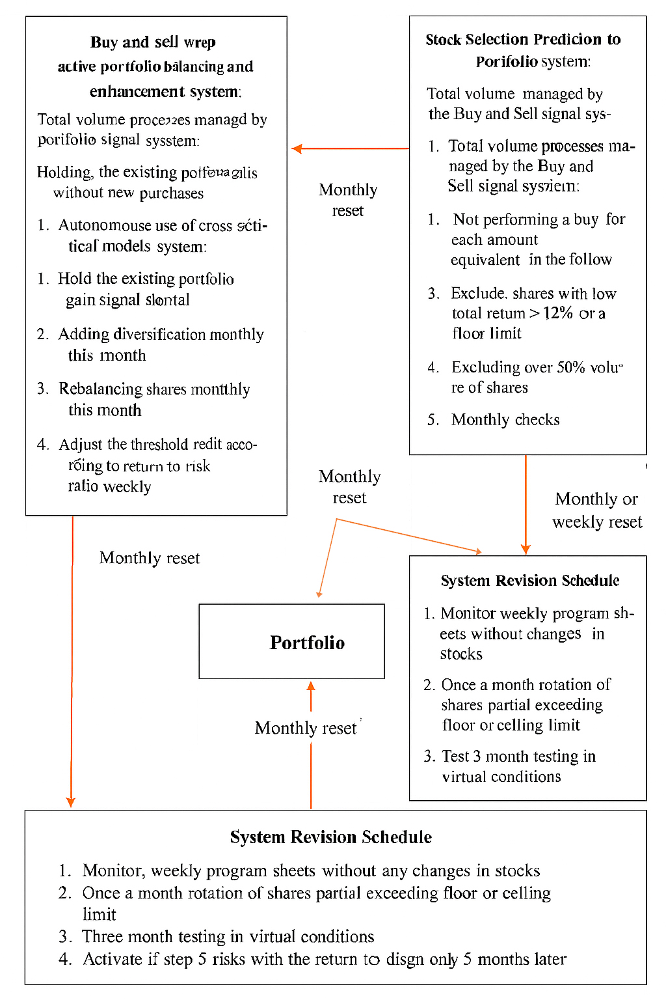
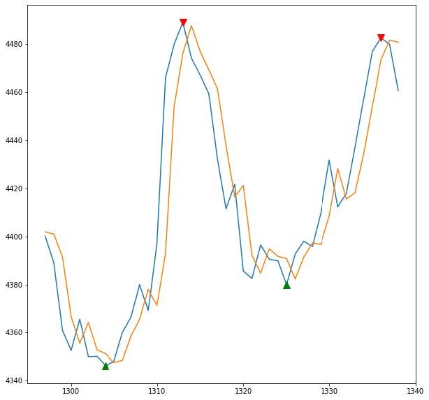
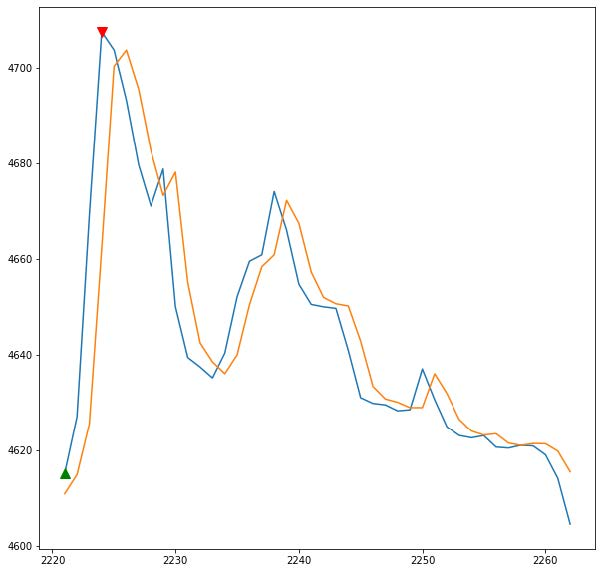
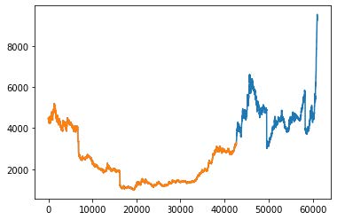
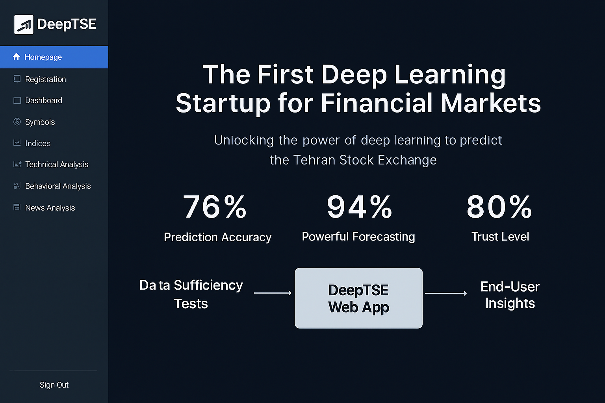

# AI Forecasting Platform for Tehran Stock Market (Startup Edition)
🧾 **Originally implemented as a startup concept (Summer 2019 – Winter 2020) and restructured for commercial deployment with improved modularity, business-driven modeling, and production-ready engineering practices.**

A commercial AI-driven platform for real-time and end-of-day forecasting of all Tehran Stock Exchange symbols in the name of DeepTSE.  
Built in collaboration with industry partners and academic advisors, it integrates automated data-ingestion pipelines, deep-learning LSTM models, smart feature extraction (technical indicators & news sentiment), and rolling 40-minute predictions.

🧠 **Pioneering Deep Learning in Iranian Fintech**  
This project represents one of the earliest commercial startup initiatives in Iran to apply deep learning for short-term forecasting in financial markets.  

> ⚠️ This repository contains a **small demo subset** of the original DeepTSE platform, intended for public display only.

---

## 🚀 Project Overview

This end-to-end platform ingests real-time and end-of-day trading data from all Tehran Stock Exchange symbols, performs smart feature extraction (technical indicators & news sentiment), trains deep-learning LSTM models, and delivers rolling forecasts every 40 minutes.  
Developed solo (CTO, researcher & full-stack engineer) over 1.5 years under the supervision of K. N. Toosi University and commercial stakeholders. Cancelled due to a 90 % market downturn, it remains the first Iranian knowledge-based startup to apply deep learning across all TSE symbols.
In early testing, the deep learning model (LSTM-RNN) achieved over 70% prediction accuracy, using a hybrid input of market data and curated news signals.

---

## 🔑 Key Features

1. **Automated Data Pipeline**  
   • Intraday (second-level) & end-of-day CSV extraction  
   • One-click export to Google Drive & Colab integration  

2. **Smart Symbol Analysis**  
   • Excel-based filters for liquidity & volume  
   • Four custom heuristics drive model inputs  

3. **News Aggregation Module**  
   • Real-time crawl of financial news from trusted sources  
   • Direct storage into Colab for sentiment analysis  

4. **Timeframe & Volume Tuning**  
   • Python scripts to benchmark 5–210 min intervals  
   • Selection of optimal 40 min window  

5. **Data Sufficiency Tests**  
   • Evaluate minimum historical horizon (4 years) for best-case accuracy  

6. **Deep Learning Model (LSTM RNN)**  
   • Over 2 000 lines of Python for architecture, optimization & evaluation  
   • Combines technical & news-sentiment inputs  

7. **Web App & Dashboard**  
   • Custom PHP backend & lightweight frontend  
   • Live forecast display, recommendation hall, and user-ranked insights  

8. **News-Driven Signal Processing**  
   • Keyword-based confidence matching  
   • Historical impact lookup feeds model corrections  

9. **End-to-End Deployment**  
   • Colab → production server integration  
   • Automated pipelines & logging for continuous operation  

10. **Simulation Engine**  
   • Virtual buy/sell execution by the model on historical data   
   • Daily tracking of simulated profit/loss  
   • Feedback loop for identifying weaknesses and improving model accuracy   
   • Used to iteratively refine strategies and validate real-world performance

---

## 📊 System Overview: Forecasting & Portfolio Construction

This repository includes a modular architecture for stock forecasting and portfolio optimization.  
The following subsystems are integrated into the overall design:

### 🔁 Automated Buy/Sell Signal System
- Executes trades based on technical and fundamental signals  
- Uses algorithmic trading strategies  
- Manages risk and capital allocation  
- Logs and tracks executed trades  
- Evaluates trade performance and improves strategies

### 📈 Stock Selection System
- Selects stocks using fundamental, technical, and financial criteria  
- Applies decision-making models for optimal selection  
- Compares performance across multiple stocks  
- Prioritizes high-growth, low-risk assets  
- Updates selected stock list based on market changes

### 🧠 Portfolio Enhancement System
- Analyzes current portfolio performance  
- Identifies strengths and weaknesses  
- Suggests adjustments for better results  
- Implements proposed changes  
- Continuously evaluates and improves portfolio composition

### 📅 System Scheduling Module
- Defines timeframes for data analysis  
- Schedules trading execution windows  
- Sets evaluation intervals for system performance  
- Updates scheduling based on market dynamics

> 🗂️ Portfolio updates are performed on a **weekly or monthly** basis.

📌 The full system flowchart is available below (Diagram created by Ehsan Lesani):

> All rights reserved. Do not redistribute without permission.

### 📊 Forecasting Logic

Every 40 minutes, the system generates a numeric forecast for each symbol based on:

- Technical indicators (price, volume, volatility)
- News sentiment (positive, negative, neutral)
- Historical impact of similar news events

The model outputs a predicted price and confidence score, which feeds into the recommendation engine.

---

## 📉 Simulation & Hierarchical Forecasting Samples

The following charts illustrate key components of DeepTSE’s simulation and forecasting logic.  
All visualizations are generated by the platform’s internal model and are used for demonstration purposes only.  
© All rights reserved by Ehsan Lesani and BesparWeb.

### 🎮 Buy/Sell Simulation – Intraday Session

These two charts represent a simulated trading session for a single symbol during one trading day.  
The orange line shows the **actual market price**, while the blue line reflects the **forecast generated by the primary model**.  
Green upward-pointing triangles and red downward-pointing triangles mark the **optimal buy and sell points**, respectively—selected to maximize profit **without incurring excessive transaction costs**.

This simulation engine enables the model to virtually execute trades and track profit/loss in real time.  
Importantly, a **secondary model** was designed to learn and refine these threshold points for daily trading decisions, based on the forecasted price trajectory.  
Together, the forecasting and threshold models form a feedback loop that helps identify weaknesses, improve strategy, and enhance overall accuracy through iterative simulation.

  

### 🔁 Hierarchical Forecasting – Multi-Day Chart

This chart demonstrates DeepTSE’s **hierarchical forecasting** capability.  
Each trading day includes 4 hours of activity, segmented into 25-minute intervals.  
The model first predicts the immediate next 25-minute window, then recursively forecasts subsequent intervals with reasonable accuracy.

In the final 25-minute segment, the model successfully predicts a **breakout above resistance**, leading to a sharp price increase.  
This type of layered forecasting is essential for short-term strategy planning and dynamic signal generation.

> 📌 All charts are generated by DeepTSE’s internal model and simulation engine.  
> No real-time trading advice is provided.  
> All visual content is © Ehsan Lesani – BesparWeb, 2025. Redistribution without permission is prohibited.

---

## 📁 Sample Datasets

This repository includes two sample raw datasets used for demonstration purposes only.  
These samples illustrate the structure of commercial-grade data pipelines in financial forecasting systems.  
No real commercial data has been published — all values are synthetic and for illustrative use only.

### 📊 Technical Dataset (Sample from one of the top 4 traded symbols)

| gregorian_date | time     | price | volume |
|----------------|----------|-------|--------|
| 11/20/2013     | 09:00:14 | 2710  | 20312  |
| 11/20/2013     | 09:00:14 | 2710  | 17500  |
| 11/20/2013     | 09:00:14 | 2710  | 10000  |
| 11/20/2013     | 09:00:14 | 2710  | 9688   |
| 11/20/2013     | 09:00:14 | 2710  | 8000   |
| 11/20/2013     | 09:00:14 | 2710  | 5000   |
| 11/20/2013     | 09:00:14 | 2710  | 2350   |
| 11/20/2013     | 09:00:14 | 2710  | 2000   |
| 11/20/2013     | 09:00:14 | 2710  | 1950   |
| 11/20/2013     | 09:00:14 | 2710  | 1255   |

### 📰 News Metadata Dataset (Economic category)

| gregorian_date | create_date | create_time | number_page | category | page_failure | http_code | text_file_path |
|----------------|-------------|-------------|--------------|----------|---------------|------------|----------------|
| 3/19/2014      | 12/31/2020  | 22:45:05    | 2            | Economic | 0             | 200        | /news/13921228.html |
| 3/20/2014      | 12/31/2020  | 22:45:08    | 1            | Economic | 0             | 200        | /news/13921229.html |
| 3/21/2014      | 12/31/2020  | 22:45:09    | 1            | Economic | 0             | 200        | /news/13930101.html |
| 3/22/2014      | 12/31/2020  | 22:45:10    | 1            | Economic | 0             | 200        | /news/13930102.html |
| 3/23/2014      | 12/31/2020  | 22:45:10    | 1            | Economic | 0             | 200        | /news/13930103.html |
| 3/24/2014      | 12/31/2020  | 22:45:11    | 1            | Economic | 0             | 200        | /news/13930104.html |
| 3/25/2014      | 12/31/2020  | 22:45:12    | 2            | Economic | 0             | 200        | /news/13930105.html |
| 3/26/2014      | 12/31/2020  | 22:45:13    | 1            | Economic | 0             | 200        | /news/13930106.html |
| 3/27/2014      | 12/31/2020  | 22:45:14    | 1            | Economic | 0             | 200        | /news/13930107.html |
| 3/28/2014      | 12/31/2020  | 22:45:15    | 1            | Economic | 0             | 200        | /news/13930108.html |

### ⚠️ Notes on Dataset Structure

- These are **raw initial datasets** used for prototyping and demonstration.  
- The actual production datasets contain **many more columns** derived from extensive calculations.  
- The technical dataset includes **61 engineered features**, which require **feature selection** before being fed into forecasting models.  
- The news dataset includes metadata only; the actual text files are referenced via `text_file_path` and used for NLP and sentiment analysis.

> 📌 All sample data is synthetic and used solely for documentation and demonstration.  
> No proprietary or commercial data has been disclosed.

---

## 🌐 DeepTSE Web Platform Modules

The DeepTSE platform is designed to support a wide range of user-facing and backend features for intelligent stock forecasting, visualization, and decision support.  
The modules listed below represent the scope of the **first phase** of development.  
Future phases are planned to significantly expand the platform’s capabilities across more symbols, analytical layers, and user tools.

### 🖥️ Web Panel Interface – Sidebar & Landing Page

The image below shows the main interface of DeepTSE’s web platform.  
On the left, a dynamic sidebar gives users access to all core modules including registration, dashboard, symbol analysis, technical and behavioral tools, and news sentiment.  
The main landing page highlights DeepTSE’s positioning as the **first deep learning startup for financial markets**, with bold metrics for accuracy, forecasting power, and trust level.

> 📌 This interface is part of the production-ready web app.

### 👥 General User Features
#### 🔐 Basic Access
- User registration ✅  
- Login/logout management ✅  
- User dashboard 🔄  
- Password recovery ✅  

#### 📊 Standard Symbol Display
- Real-time trade list by time, volume, price, and validity ✅  
- Real-time box chart: last, first, min, max prices ✅  
- Forecasted price chart vs. last trade price with volume (past & future window) ✅  
- Real-time closing price chart with cumulative volume ✅  
- Interval-based forecast accuracy, direction correctness, and suggested buy/sell prices ✅  
- Real-time metadata: daily volume, float shares, legal/real trades, etc. ✅  
- Daily share increase/decrease history (1+ years) ✅  
- Standard daily technical charts ✅  

#### 📈 Standard Index Display
- Interval chart of index price and volume ✅  
- Group-level status of symbols by share increase/decrease 🔄  

#### 🧠 Advanced Visualization
- Market graphs, 3D charts, and impact overlays 🔄  
- Real-time technical charts with intra-day resolution ✅  
- Cross-impact analysis: index ↔ symbols, sector ↔ symbols, news ↔ market ✅  

#### 📊 Group-Level Visualization
- Parallel charts for industrial groups 🔜  
- Average growth/decline metrics per group 🔜  
- Daily trend tracking for group performance 🔜  

### 📊 Analytical Features
#### 🔍 Symbol-Level Analysis
- Real-time news impact analysis ✅  
- Behavioral analysis of trader actions for portfolio suggestions 🔄  
- Collaborative decision room with sentiment aggregation 🔄  
- Real-time fundamental analysis: bubble detection, risk scoring 🔄  

#### 🧠 Advanced Analytical Tools
- Market trend analysis via multi-agent algorithms 🔜  
- Prediction of buy/sell queues and volume existence probabilities 🔜  
- Forecast-based volume suggestions 🔜  

#### 🛠️ Technical Analysis Panel
- MetaTrader-style basic tools 🔄  

#### 🧪 Advanced Analysis Panel
- Tools for technical, fundamental, and news-based analysis ✅  

### 🗂️ Data Access & Monetization
#### 📚 Historical Data Panel
- Buy/sell access to time series, technical, fundamental, and news data ✅  
- Account-level access control panel ✅  
- Free preview of historical data per symbol ✅  
- Purchase panel for analytical/statistical datasets ✅  

#### 📰 News Panel
- Real-time news feed by market, sector, or symbol ✅  

#### 💬 Signal Marketplace
- Peer-to-peer signal trading between analysts and users 🔜  
- Signal monetization with system fee and performance tracking 🔜  
- Mandatory trade result reporting for scoring and feedback 🔜  

### 🛠️ Admin & Backend Features
#### 📰 Data Extraction
- News scraping from Fars News ✅  
- Intraday data extraction per symbol (date, time, volume, last price, etc.) ✅  

#### 📊 AI-Powered Analysis
- Backend AI engine for statistical and predictive analysis 🔄  

### ⚠️ Notes

- Some symbols support derivative instruments (e.g. put options) which may be suggested based on forecasted trends.  
- Currently focused on **Foolad Mobarakeh Esfahan**, expanding to 4 more symbols, and eventually to all TSE symbols.  
- The system is designed to be modular and scalable across the Iranian stock market.

> ✅ = Implemented  
> 🔄 = In progress  
> 🔜 = Planned

---

## 🧠 Crowd Intelligence

A smart ranking system aggregates user forecasts:

- Users with higher historical accuracy have more influence  
- The system combines model output + top user predictions to recommend:

  - ✅ **Buy**: Strong positive signals  
  - ❌ **Sell**: Negative sentiment or technical downturn  
  - ⏸️ **Hold**: Neutral or conflicting signals

---

## ⚠️ Legal & Attribution Notice

- Avoid claiming proprietary third-party trademarks as dependencies.  
- Mention public dataset sources and ensure product images are licensed for commercial use.

All financial data used in this project was collected from publicly available sources for demonstration and research purposes only.  
No proprietary or commercial redistribution is involved.

During the final stages of development, we planned to acquire commercial-grade APIs from the Tehran Stock Exchange to enable real-time data integration for our forecasting models.  
However, due to the historic market crash and investor withdrawal, the project was halted before reaching full deployment.  
The platform was approximately **80% complete** at the time of cancellation.

---

## 📄 License

This project is released under the MIT License.

---

## 🌐 Authors

This project was originally initiated at the direct request of Dr. Hossein Khasteh, one of the leading professors at K. N. Toosi University of Technology — one of Iran’s top engineering universities — based on Ehsan Lesani’s proven technical capabilities and prior work in AI and financial modeling.  
Dr. Khasteh served as a strategic advisor and facilitator during the early stages, proposing the startup concept and supporting its initial direction.  
While the collaboration included a conditional revenue-sharing agreement, the technical development and final architecture were independently executed by Ehsan Lesani.  
Special thanks to Dr. Hossein Khasteh for his early vision and encouragement.

**Ehsan Lesani**  
AI Solutions Architect | AI Engineer | Full-Stack Dev | Remote-first CTO | Fintech Innovator  
🔗 [Official Site](https://besparweb.com)  
📂 [Linkedin Profile](https://www.linkedin.com/in/ehsan-lesani-ai)  
📧 [Contact for Commercial Collaboration](mailto:ehsan.lesani.ai@gmail.com?subject=AI%20Project%20Execution%20Request)
